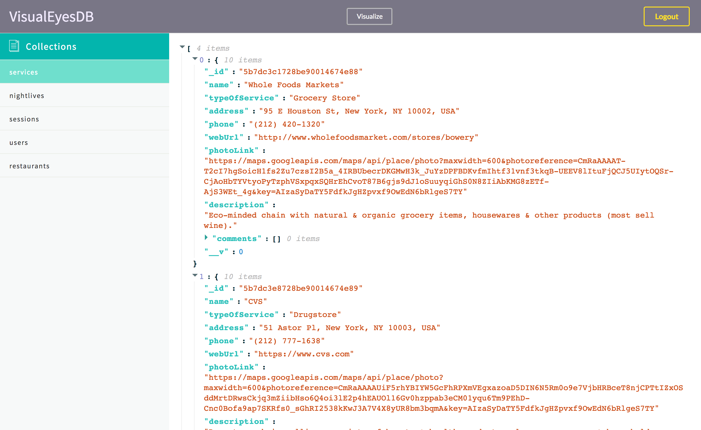

# VisualEyesDB

## VisualEyesDB is a open source web-based GUI for MongoDB enthusiasts. 

Built on top of established, powerful project, VisualEyes version 2.0.0. now empowers users to make smarter decisions about their databases. It offers intuitive and easy-to-use UI, full CRUD functionality, and visualization of data.

# Technologies used:
* Javascript, ES6, ES7
* NodeJS, ExpressJS
* React
* TreeJS
* Semantic UI React

